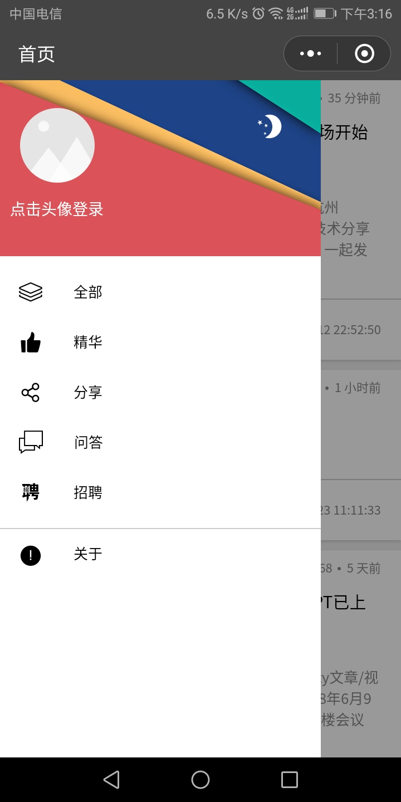
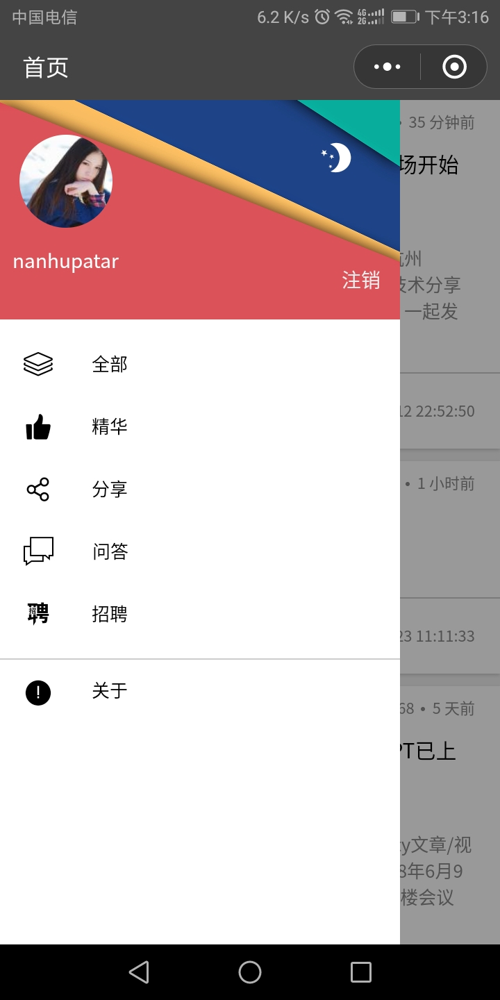
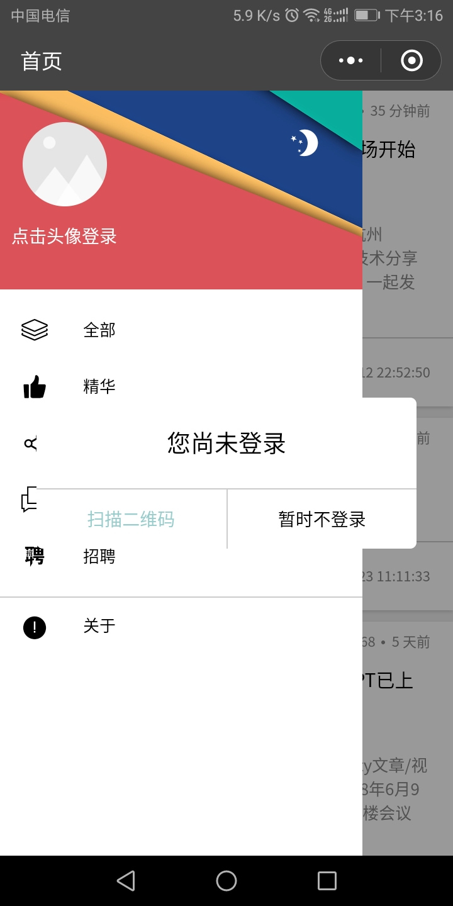
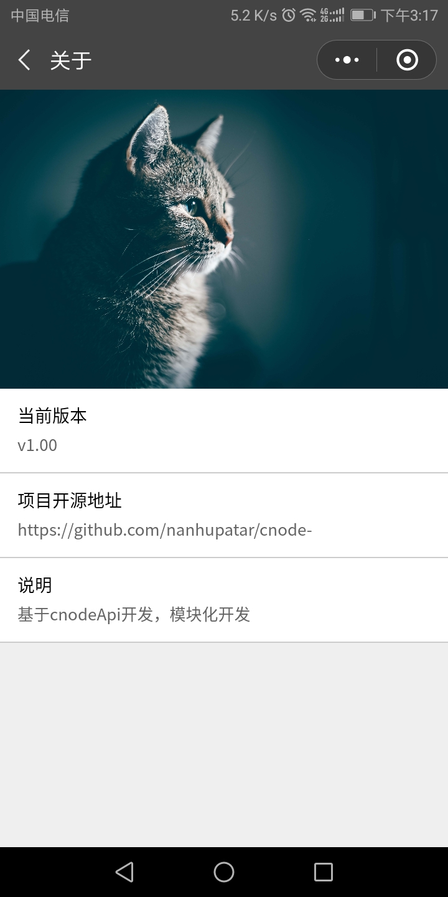

# cnode-
cnode社区第三方客户端，小程序端
小程序码：cnode微助手  
   
  
简介：原生开发，使用towxml解析markdown，小程序存在着一些问题，比如不支持滑动侧边栏等，将在后期迭代中实现，同时，欢迎提交bug反馈。

**感谢**：https://github.com/coolfishstudio/wechat-webapp-cnode 提供的教程  
**感谢**  https://github.com/web-L/wxCNode 提供的组件    
**感谢**  https://github.com/TakWolf/CNode-Material-Design  提供的界面样式参考

功能：  
> 扫码登录  
> 查看用户信息  
> 收藏
> 点赞
> 五种不同文章类目切换

主页效果,用户详情：   
<figure class="half">
    
    
</figure>

侧边栏效果:  
<figure class="half">
    
    
</figure>
  
登录,关于：
<figure class="half">
    
    
</figure>
  
文档结构：
├─components
│  ├─bar-slider  -------------------------- 侧边栏组件
│  ├─go-top      -------------------------- 返回顶部组件
│  ├─login       -------------------------- 登录组件
│  ├─n-mask      -------------------------- 蒙层组件
│  ├─topics      --------------------------列表组件
│  └─touch-gesture --------------------------手势
├─pages
│  ├─about  --------------------------关于页面
│  ├─content   --------------------------文章详情页面
│  │  └─component
│  │      ├─replies --------------------------回复列表组件
│  │      └─topic-header--------------------------详情头部文件
│  ├─index    -------------------------- 首页（入口）
│  └─user     -------------------------- 用户详情
│      └─component        
│          ├─topic-list  --------------------------收藏列表组件
│          └─topic-swiper -------------------------- swiper组件
├─static
│  ├─css      --------------------------公共样式
│  └─images   --------------------------静态文件
├─towxml      --------------------------towxml库
│  ├─lib      
│  ├─plugins
│  │  └─hljs
│  │      ├─languages
│  │      └─style
│  └─style
│      └─theme
└─utils     --------------------------工具库  
  
qa：
1. Q:为什么不用wxparse？  
   A:wxparse渲染代码时会有bug，不能完整渲染   
  
2. Q:非原创？  
   A:绝大部分组件来自于github开源的一些代码，我觉得写的很好了，只对一部分细节做了更改，然后重新将ui部分修改了，使之样式和cnode社区安卓版基本类似。
  
3. Q：有bug？ 
   A：是的，包括滑动穿透，蒙层层级问题的一系列bug，虽然不影响使用，将会在后期迭代中解决  
  

